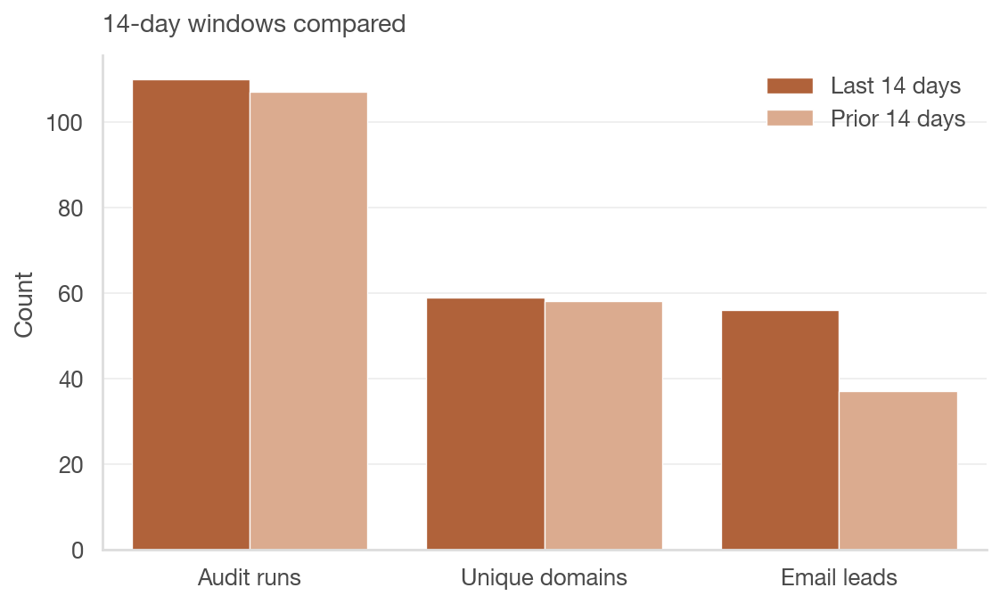
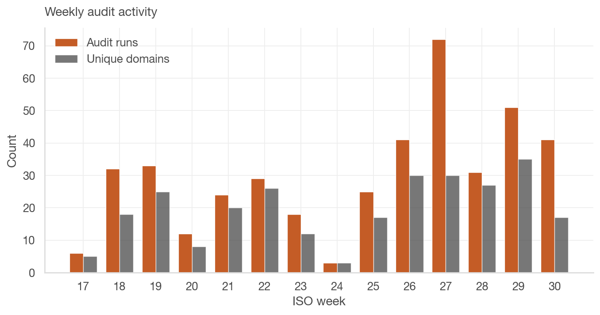
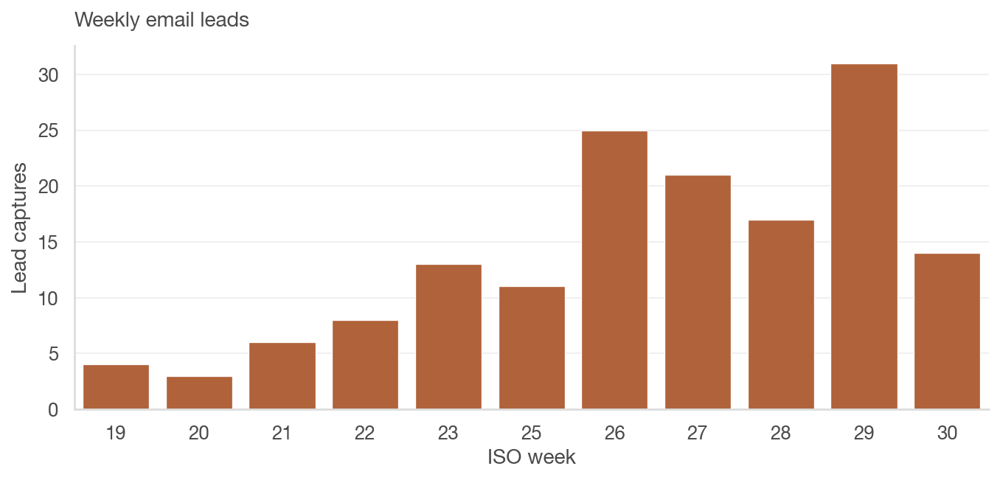
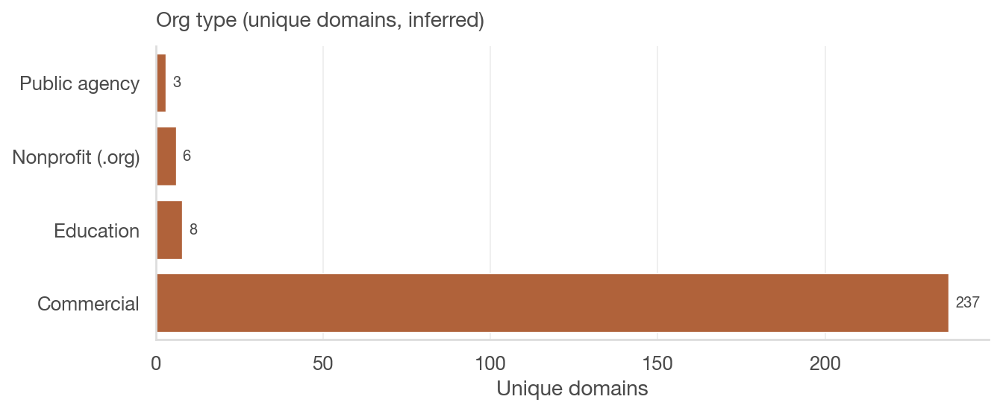
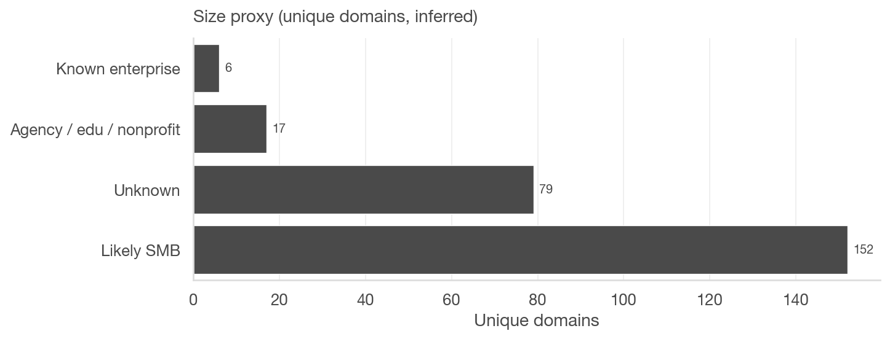
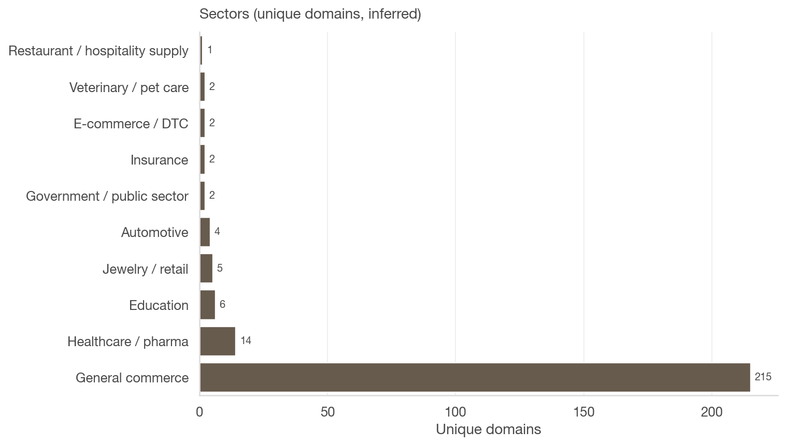

# GotCIPA audit activity: what the usage data shows

> **Data through 2026-07-22** · Aggregate trends from [gotcipa.com](https://gotcipa.com) · Generated by the [gotcipa_data_story](https://github.com/papayaverse/gotcipa_data_story) pipeline.

Aggregate trends to support the stop CIPA shakedowns narrative — everyday businesses, nonprofits, and public agencies checking real sites, not a technical treatise on cookies or pixels.

---

## Why this exists

GotCIPA (Papaya’s public CIPA risk audit) gives people a way to see whether everyday website tracking may create legal exposure under California’s Invasion of Privacy Act. When demand letters and filings accelerate, more merchants, agencies, and operators run checks before the legislative window closes.

This report summarizes **aggregate** activity from email-captured leads and completed audit runs. It is meant to complement ACTUM’s policy story.

> **Context (ACTUM, not GotCIPA data):** In a review of 64 CIPA class actions, ACTUM cites average attorney fees of about $2 million and average class member recovery of about $17.

## The spike

In the most recent 14 days ending **2026-07-22**, GotCIPA recorded **110** audit runs across **59** unique domains, compared with 107 runs and 58 unique domains in the prior 14 days.

Email lead captures (excluding internal/test addresses): **56** vs 37 in those same windows.

| Metric | Value |
|--------|------:|
| Total audit runs (export window) | 449 |
| Unique domains audited | 254 |
| Unique visitor emails (excl. internal/test) | 98 |
| Runs with full accept + GPC session paths | 46 |

*Last 14 days vs prior 14 days · audit runs, unique domains, email leads*

*Source: audit_requests export · through 2026-07-22*

*Source: audit_leads export · through 2026-07-22*

Weekly tables (data)

### Weekly audit runs

| Week | Audit runs | Unique domains |
|------|----------:|---------------:|
| 2026-W17 | 6 | 5 |
| 2026-W18 | 32 | 18 |
| 2026-W19 | 33 | 25 |
| 2026-W20 | 12 | 8 |
| 2026-W21 | 24 | 20 |
| 2026-W22 | 29 | 26 |
| 2026-W23 | 18 | 12 |
| 2026-W24 | 3 | 3 |
| 2026-W25 | 25 | 17 |
| 2026-W26 | 41 | 30 |
| 2026-W27 | 72 | 30 |
| 2026-W28 | 31 | 27 |
| 2026-W29 | 51 | 35 |
| 2026-W30 | 41 | 17 |

### Weekly email leads

| Week | Leads |
|------|------:|
| 2026-W19 | 4 |
| 2026-W20 | 3 |
| 2026-W21 | 6 |
| 2026-W22 | 8 |
| 2026-W23 | 13 |
| 2026-W25 | 11 |
| 2026-W26 | 25 |
| 2026-W27 | 21 |
| 2026-W28 | 17 |
| 2026-W29 | 31 |
| 2026-W30 | 14 |

### Volume hygiene: repeat testers

Raw run counts can be inflated when one organization tests repeatedly. Domains with five or more runs:

| Domain | Runs |
|--------|-----:|
| restaurantware.com | 34 |
| westernvetpartners.com | 32 |
| inayajewelry.com | 14 |
| happytailsvetclinic.com | 13 |
| customizable.com | 10 |
| bylvayhcp.com | 8 |
| nature.com | 7 |
| rxexpressmarketing.com | 5 |

## Who is checking

Among **160** lead rows (after filtering **13** internal, test, or disposable addresses), about **25%** used consumer email domains (Gmail, etc.) — a rough signal of individuals and small operators rather than only enterprise security teams.

> Public-agency signals are present in the dataset (e.g. .gov email or government-related domains).

*Inferred from email/URL TLDs and domain keywords*

*Not firmographic census data — heuristic buckets only*

## What kinds of sites

Sector tags are inferred from domain names. Counts are **unique domains**, not raw audit volume.

Sector table (data)

| Sector | Unique domains |
|--------|---------------:|
| General commerce | 215 |
| Healthcare / pharma | 14 |
| Education | 6 |
| Jewelry / retail | 5 |
| Automotive | 4 |
| Veterinary / pet care | 2 |
| E-commerce / DTC | 2 |
| Insurance | 2 |
| Government / public sector | 2 |
| Restaurant / hospitality supply | 1 |

### Category-level examples (no contact details)

- General commercial website (one of several similar sites in this dataset)
- Healthcare or life-sciences organization (one of several similar sites in this dataset)
- College or university property (one of several similar sites in this dataset)
- Independent jewelry or specialty retailer (one of several similar sites in this dataset)
- Automotive dealer or services (one of several similar sites in this dataset)
- Regional veterinary or pet-care business
- Direct-to-consumer or e-commerce brand
- Insurance or benefits provider
- Public-agency or state-related site
- Restaurant or hospitality supplier

## Middle tech and ordinary commerce

Most audited properties in this export look like everyday commerce and services — restaurants and suppliers, regional healthcare and veterinary groups, retailers, and similar — not a roster of large consumer platforms alone. Sites in this position often use mainstream analytics and advertising tags for ordinary business reasons.

This export does **not** include a per-run inventory of Meta pixels, Google tags, or other vendors. A future CSV column (e.g. `tracker_vendors`) can slot into the same regeneration pipeline when available.

## What we cannot claim from this dataset

- **No geography or IP:** GotCIPA does not store visitor IP or geo.
- **Size and sector are inferred**, not verified firmographics.
- **Verdict fields are sparse** in the leads export (most rows lack a filled verdict).
- **No individual emails or identifiable contacts** appear in this document by design.

---

## Regenerate locally

Raw audit CSVs are not published in this repo. To refresh these numbers:

1. Place private exports at `data/audit_leads.csv` and `data/audit_requests.csv`
2. Run `python scripts/build_story.py`
3. Commit `output/data_story.md`, `output/charts/`, and `output/aggregates.json`